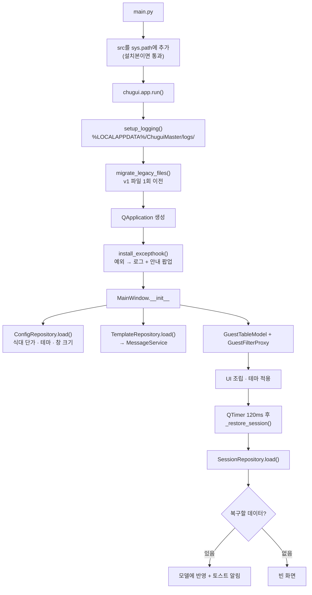
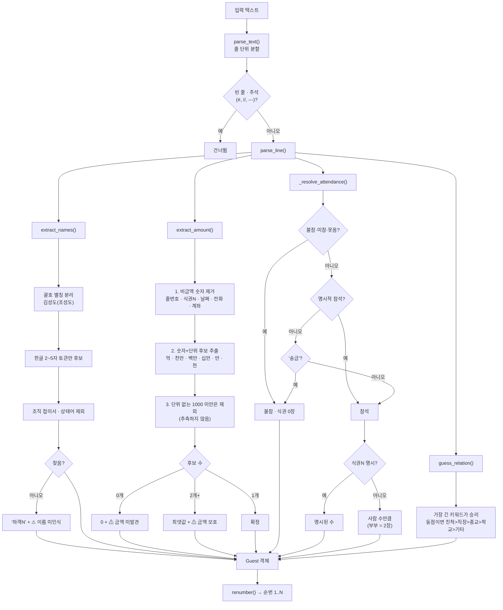
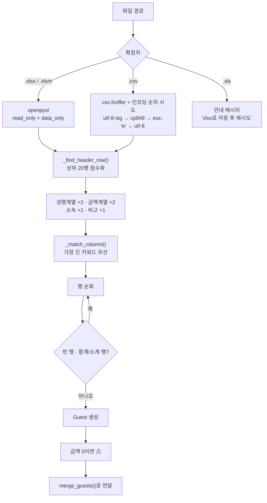
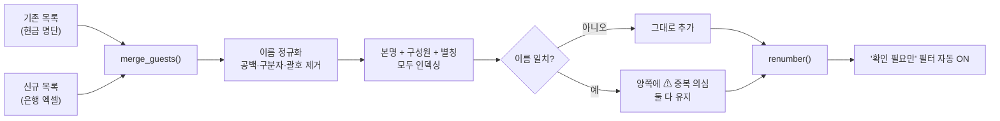
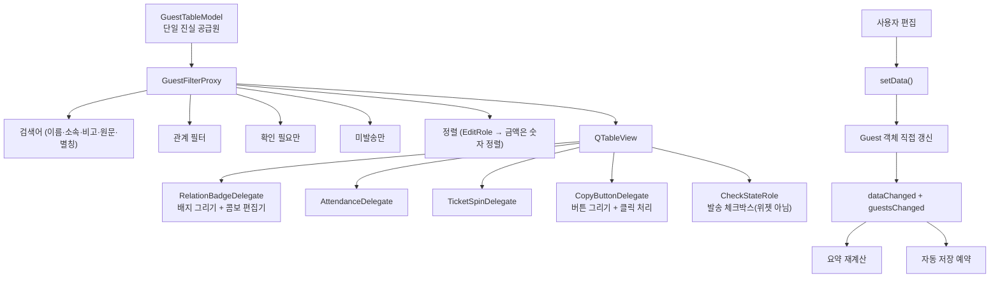
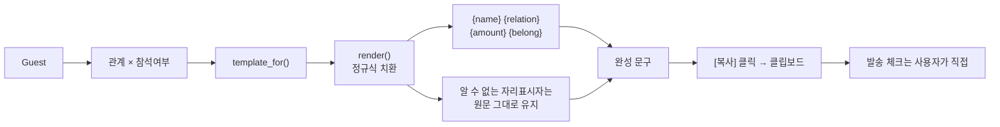
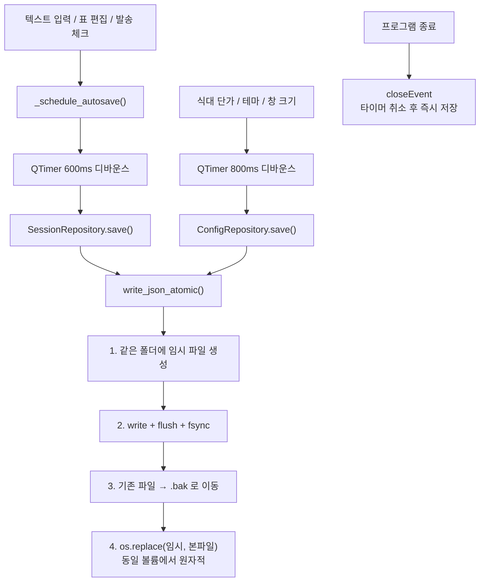
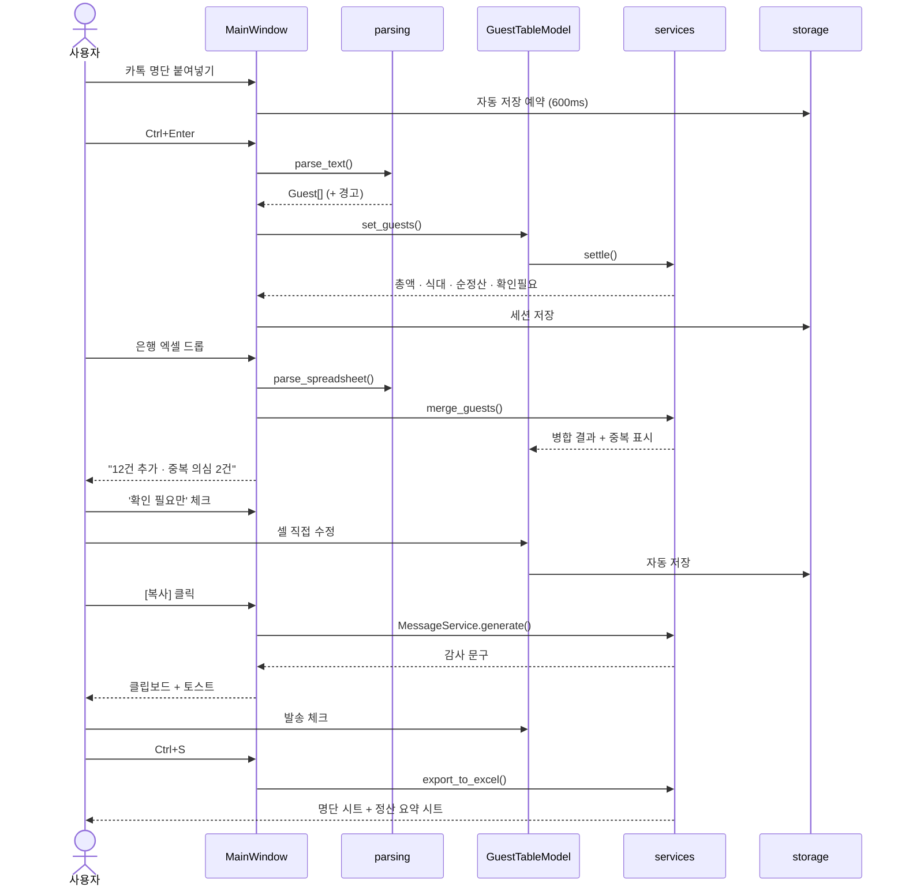

# ChuguiMaster 동작 Flow

> v2.0.0 기준. 이 문서는 **코드가 실제로 하는 일**을 기술한다.
> 기능 소개는 [README.md](README.md)를 참고.

---

## 1. 계층 구조

의존 방향은 **한 방향**이다. 아래 계층은 위 계층을 절대 import 하지 않는다.

```
┌─────────────────────────────────────────────────────────────┐
│  ui/          MainWindow · GuestTableModel · Delegates      │  PySide6 의존
│               Dialogs · Widgets · Theme                     │
└───────────────────────────┬─────────────────────────────────┘
                            │ 호출
┌───────────────────────────▼─────────────────────────────────┐
│  services/    settlement · messages · merge · exporter      │  Qt 비의존
├─────────────────────────────────────────────────────────────┤
│  parsing/     amount · names · relations                    │  Qt 비의존
│               text_parser · excel_parser                    │  순수 함수
├─────────────────────────────────────────────────────────────┤
│  storage/     paths · atomic · repositories                 │  Qt 비의존
├─────────────────────────────────────────────────────────────┤
│  models.py    Guest · Relation · Attendance · Payment       │  의존 없음
└─────────────────────────────────────────────────────────────┘
```

`services` / `parsing` / `storage` 가 Qt에 의존하지 않는 것이 핵심이다.
그래서 전체 테스트 352개 중 GUI가 필요한 것은 표 모델·UX 테스트뿐이고,
파싱·정산·저장 테스트 184개는 순수 함수 테스트로 몇 밀리초 만에 돈다.
GUI 테스트도 `QT_QPA_PLATFORM=offscreen` 으로 헤드리스 환경에서 실행된다.

---

## 2. 기동 Flow



**세션 복구가 안전한 이유**: `Guest.from_dict()` 가 어떤 형태의 dict도 받아
유효한 객체를 만든다. 키가 빠졌거나 v1 스키마(`attended`, `guest_data`)여도
예외를 던지지 않는다.

> v1은 여기서 죽었다. 저장소에 커밋된 `autosave_session.json` 에
> `{"id":1,"name":"테스트"}` 라는 부분 레코드가 들어 있었고,
> 렌더링 코드가 `guest['relation']` 을 `.get()` 없이 읽어
> clone한 모든 사용자가 첫 실행에서 `KeyError` 팝업을 봤다.

---

## 3. 텍스트 파싱 Flow

`[자동 취합 및 파싱]` 또는 `Ctrl+Enter`



### 금액 파싱 규칙표

| 입력 | 결과 | 근거 |
|---|---|---|
| `1 홍길동 200000 친척모임` | 200,000 | 선행 줄번호 제거 |
| `최동료 10만 식권2` | 100,000 | `식권2` 제거 후 단위 해석 |
| `홍대인 50,000 회사` | 50,000 | 이름 속 `대인`은 식권 표기가 아니다 |
| `박지성 100,000 천안` | 100,000 | `천안`의 `천`은 단위가 아니다 |
| `10만 5천원` | 105,000 | 단위 내림차순 → 합산 |
| `3억 2천만원` | 320,000,000 | `천만` 을 `천` 보다 먼저 매칭 |
| `2025-03-14 홍길동 100,000` | 100,000 | 날짜 제거 |
| `홍길동 010-1234-5678 100000` | 100,000 | 전화번호 제거 |
| `500` | **0 + ⚠** | 단위 없는 1000 미만은 추측하지 않음 |
| `이백만원` | **0 + ⚠** | 한글 수사 미지원 → 사용자 확인 |

> v1은 줄 전체에서 `re.findall(r'\d+')` 한 결과를 **이어붙였다**.
> `1 홍길동 200000` → `"1"+"200000"` = 1,200,000원(6배).
> `500` 은 `< 1000` 이라는 이유로 500만원으로 승격됐다.

---

## 4. 스프레드시트 파싱 Flow

파일 드롭 또는 `[엑셀 / CSV 불러오기]`



**은행 거래내역 지원**: `보낸분` / `입금액` / `기재내용` / `적요` 컬럼명을 인식하고,
상단 안내 행(계좌번호·조회기간)을 자동으로 건너뛴다.

> v1은 `pd.read_excel(path)` 로 첫 행을 무조건 헤더로 잡아 은행 엑셀을 통째로 실패했고,
> 파일 다이얼로그와 드래그&드롭에서 `.csv` 를 받아놓고 `read_excel` 만 호출해
> `ValueError` 로 죽었다.

---

## 5. 병합 Flow (현금 + 계좌이체)



**같은 이름을 자동 병합하지 않는 이유**: 축의금은 돈이다.
동명이인이 현금과 계좌로 각각 낸 경우와 같은 사람이 중복 기입된 경우를
프로그램이 구분할 수 없다. 한 건을 조용히 삼키는 것보다 사용자에게
확인시키는 편이 항상 안전하다.

> v1에는 병합 자체가 없었다. `self.guest_data = parse_...()` 로
> 통째로 덮어써서, 텍스트를 취합한 뒤 엑셀을 드롭하면 현금 내역이 전부 사라졌다.
> README가 내세운 핵심 기능 2번이 코드에 존재하지 않았다.

---

## 6. 정산 Flow

값이 바뀔 때마다(`guestsChanged` · 식대 스핀박스) 재계산된다.

```
총 축의금   = Σ guest.amount
대인 식권   = Σ guest.adult_tickets      ← 불참자는 0
소인 식권   = Σ guest.child_tickets
총 식대     = 대인식권 × 대인단가 + 소인식권 × 소인단가
최종 순정산 = 총 축의금 − 총 식대
```

| | v1 | v2 |
|---|---|---|
| 식대 기준 | 하객 **명** 수 | 발급 **식권** 수 |
| `식권2` 파싱 결과 | 사용 안 함 | 반영 |
| 소인 단가 | **계산에 미반영** | 반영 |
| 불참 하객 | 식대 차감됨 | 제외 |

---

## 7. 표 렌더링 Flow (Model/View)



**델리게이트를 쓰는 이유**

| | v1 (QTableWidget) | v2 (Model/View) |
|---|---|---|
| 검색 1글자 입력 | 표 전체 재구축, 300행이면 위젯 1,500개 생성 | 프록시 필터만 재평가, 위젯 생성 0개 |
| 셀 편집 | `guest_data` 미반영 → 다음 렌더링에 **조용히 원복** | `setData` 로 즉시 반영 + 자동 저장 |
| 관계 변경 | 콤보 시그널 안에서 `setRowCount(0)` → **자기 자신 파괴** | 재진입 구조 자체가 없음 |
| 정렬 | 없음 | 모든 열, 금액은 숫자 기준 |

---

## 8. 감사 메시지 Flow



**`str.format` 을 쓰지 않는 이유**: 템플릿은 사용자가 자유 편집한다.
`.format()` 은 `{` 하나만 있어도 `KeyError` 를 던진다.

> v1은 그 예외가 표 렌더링 루프 안에서 터져 **표 전체가 죽었고**,
> 잘못된 템플릿은 JSON에 영구 저장되어 재실행해도 계속 죽었다.
> v2는 정규식 치환이라 어떤 사용자 입력으로도 예외가 나지 않고,
> 저장 시 미지원 자리표시자를 안내만 한다.

**복사 ≠ 발송**: v1은 복사 버튼을 누르면 자동으로 발송완료 처리했다.
문구를 확인만 하려고 눌러도 발송 처리되어 추적이 무의미해졌다.
v2에서 발송 체크는 사용자가 직접 한다.

---

## 9. 저장 Flow



**읽기 시 자동 복구**: `read_json()` 은 본 파일이 깨졌으면 `.bak` 을 시도한다.

| | v1 | v2 |
|---|---|---|
| 저장 위치 | 실행 디렉터리 (상대 경로) | `%LOCALAPPDATA%\ChuguiMaster\` |
| 저장 빈도 | **키 입력 한 번마다 전체 JSON** | 600ms 디바운스 |
| 저장 방식 | 대상 파일 직접 덮어쓰기 | 임시 파일 + `os.replace` |
| 손상 시 | 복구 불가 | `.bak` 자동 복구 |
| 실패 시 | `except: pass` (무성) | 로그 + 상태바 안내 |

> v1은 `Program Files` 에 설치하면 저장이 실패하는데 사용자는 영문도 몰랐다.
> `--onefile` exe는 실행 위치가 매번 달라 설정이 여기저기 흩어졌다.

---

## 10. 전체 사용자 시나리오



---

## 11. 오류 처리 원칙

| 상황 | 동작 |
|---|---|
| 파서가 확신 못 함 | 추측하지 않고 `⚠ 확인 필요` 표시, KPI 카드에 건수 노출 |
| 사용자 파일이 이상함 | `ExcelParseError` → 원인이 담긴 안내 다이얼로그 |
| 저장 실패 | 로그 기록 + 상태바 안내 (무성 실패 금지) |
| 세션 파일 손상 | `.bak` 자동 복구, 실패 시 빈 세션 |
| 처리되지 않은 예외 | 로그 + "작업은 자동 저장되어 있습니다" 안내, 로그 경로 표시 |
| 잘못된 사용자 템플릿 | 예외 없이 원문 유지, 저장 시 안내 |

로그 위치: `%LOCALAPPDATA%\ChuguiMaster\logs\chugui.log` (1MB × 3세대 회전)

---

## 12. 테스트 구성

| 파일 | 개수 | 범위 |
|---|---:|---|
| `conftest.py` | — | 데이터 디렉터리 격리(`CHUGUI_DATA_DIR`), 오프스크린 Qt |
| `test_ux.py` | 109 | 대비비 · 접근성 · 빈 상태 · 레이아웃 · 피드백 |
| `test_amount.py` | 40 | 금액 파서 — v1의 6배 오류 회귀 방지 |
| `test_tickets.py` | 32 | 식권 표기 — 이름 속 '대인/소인' 오인 회귀 방지 |
| `test_messages.py` | 30 | 템플릿 크래시 방지 · 자리표시자 · 조사 문제 |
| `test_names_relations.py` | 29 | 이름 추출 — v1의 글자 단위 삭제 버그 회귀 방지 |
| `test_storage.py` | 28 | 원자적 쓰기 · 손상 복구 · v1 스키마 호환 |
| `test_text_parser.py` | 28 | 자유 텍스트 통합 + 샘플 데이터 총액 고정 |
| `test_ui_model.py` | 27 | 모델 · 프록시 · 정렬 (오프스크린) |
| `test_excel_export.py` | 15 | 헤더 탐색 · CSV · 내보내기 |
| `test_settlement_merge.py` | 14 | 정산식 + 병합 |
| **합계** | **352** | |

```bash
python -m pytest
```

파싱·정산 로직은 Qt에 의존하지 않으므로 GUI 없이 검증된다.
GUI가 필요한 테스트도 `QT_QPA_PLATFORM=offscreen` 으로 헤드리스 CI에서 돈다.

---

## 13. UX 검증

디자인은 코드 리뷰로 지키기 어렵다. 객관적으로 측정 가능한 것은 테스트로 고정한다.
`tests/test_ux.py` 가 검사하는 항목:

### 대비비 (WCAG 2.1 AA)

모든 텍스트 색 × 배경 조합을 **2개 테마 전부** 계산한다.

| 대상 | 기준 |
|---|---|
| 본문 텍스트 (`text` · `text_muted` · `text_subtle`) × 4개 표면 | 4.5:1 |
| 강조색 · 위험색 · 경고 배너 | 4.5:1 |
| 관계 배지 5종 텍스트 | 4.5:1 |
| 채워진 버튼(primary · success) 위의 흰 글씨 | 4.5:1 |
| 포커스 링 · 입력 테두리 | 3:1 |
| 교대 행 줄무늬 | 1.01 ~ 1.35 (구분되되 거슬리지 않게) |

> 이 테스트가 실제로 두 건을 잡았다. success 버튼의 `#059669` 는 흰 글씨 기준 3.77:1로
> 미달이라 `#047857` 로 낮췄고, 라이트 테마 순정산 값 색도 같은 이유로 조정했다.

### 접근성

- 모든 상호작용 컨트롤이 `accessibleName` 또는 툴팁을 가진다
- KPI 카드가 `accessibleDescription` 으로 현재 값을 노출한다
- 단축키(`Ctrl+Enter` · `Ctrl+S` · `Ctrl+F`)가 등록되어 있고 실제로 동작한다
- 편집 가능한 열이 그 사실을 툴팁으로 알린다
- 복사 셀이 보낼 문구를 미리 보여준다

### 레이아웃 견고성

- 선언한 최소 창 크기가 레이아웃의 실제 요구치보다 크다 (가로 스크롤 방지)
- KPI 값이 어떤 금액(10만 ~ 3억 2천만)에서도 잘리지 않는다
- 짧은 값에서는 큰 글씨를 유지한다 (무조건 축소하면 위계가 무너진다)
- 토스트가 창 밖으로 나가지 않고, 창 크기가 바뀌면 다시 중앙에 온다
- 스플리터로 패널을 0px까지 접을 수 없다

> 이 테스트가 KPI 행 과밀을 잡았다. 초안은 카드 5장(식대 입력 포함)을 한 줄에 넣어
> 카드 폭이 179px까지 좁아졌고, `100,000원` 조차 기본 크기로 표시되지 못했다.
> 입력은 지표가 아니므로 별도 설정 줄로 분리해 카드를 273px로 넓혔다.

### 상태 · 피드백

- 빈 화면일 때 빈 격자 대신 다음 할 일을 안내한다
- 필터 결과가 0건일 때와 데이터가 아예 없을 때 **다른 문구**를 보여준다
- 확인 필요 배너는 0건이면 나타나지 않고, 고치면 사라진다
- 확인 필요 행은 배경색으로 구분되며 테마를 따라간다
- 복사해도 발송완료로 표시되지 않는다
- 상태바가 건수 · 평균 · 발송 진행률을 요약한다
- 카드가 숫자의 근거를 캡션으로 보여준다 (사용자가 검산할 수 있게)
