# ChuguiMaster 동작 Flow

> v2.3.0 기준. 이 문서는 **코드가 실제로 하는 일**을 기술한다.
> 기능 소개는 [README.md](README.md)를 참고.

---

## 1. 계층 구조

의존 방향은 **한 방향**이다. 아래 계층은 위 계층을 절대 import 하지 않는다.

```
┌─────────────────────────────────────────────────────────────┐
│  ui/          MainWindow · GuestTableModel · Delegates      │  PySide6 의존
│               Dialogs · Widgets · Theme                     │
└───────────────────────────┬─────────────────────────────────┘
                            │ 호출
┌───────────────────────────▼─────────────────────────────────┐
│  services/    settlement · messages · merge · exporter      │  Qt 비의존
│               relation_map · text_export                    │
├─────────────────────────────────────────────────────────────┤
│  parsing/     amount · names · relations · tickets           │  Qt 비의존
│               columns · text_parser · excel_parser          │  순수 함수
├─────────────────────────────────────────────────────────────┤
│  storage/     paths · atomic · repositories                 │  Qt 비의존
│               snapshots · crash                             │
├─────────────────────────────────────────────────────────────┤
│  models.py    Guest · Relation · Attendance · Payment       │  의존 없음
└─────────────────────────────────────────────────────────────┘
```

`services` / `parsing` / `storage` 가 Qt에 의존하지 않는 것이 핵심이다.
그래서 파싱·정산·병합·저장 테스트는 GUI 없이 순수 함수 테스트로 몇 밀리초 만에 돈다.
Enter 갱신의 줄 맞춤(`sync_with_text`)도 화면이 아니라 `services/merge.py` 에 있어 따로 검증된다.
GUI 테스트도 `QT_QPA_PLATFORM=offscreen` 으로 헤드리스 환경에서 실행된다.

---

## 2. 기동 Flow

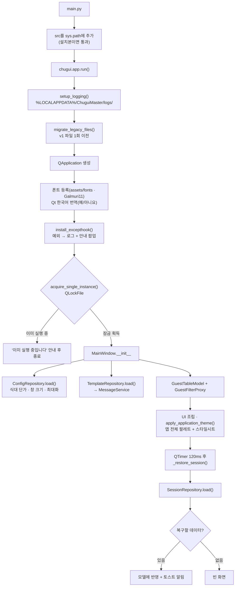
```mermaid
flowchart TD
    A["main.py"] --> B["src를 sys.path에 추가<br/>(설치본이면 통과)"]
    B --> C["chugui.app.run()"]
    C --> D["setup_logging()<br/>%LOCALAPPDATA%/ChuguiMaster/logs/"]
    D --> E["migrate_legacy_files()<br/>v1 파일 1회 이전"]
    E --> F["QApplication 생성"]
    F --> F1["폰트 등록(assets/fonts · Galmuri11)<br/>Qt 한국어 번역(예/아니요)"]
    F1 --> G["install_excepthook()<br/>예외 → 로그 + 안내 팝업"]
    G --> G1{"acquire_single_instance()<br/>QLockFile"}
    G1 -- "이미 실행 중" --> G2["'이미 실행 중입니다' 안내 후 종료"]
    G1 -- 잠금 획득 --> H["MainWindow.__init__"]
    H --> I["ConfigRepository.load()<br/>식대 단가 · 창 크기 · 최대화"]
    H --> J["TemplateRepository.load()<br/>→ MessageService"]
    H --> K["GuestTableModel + GuestFilterProxy"]
    K --> L["UI 조립 · apply_application_theme()<br/>앱 전체 팔레트 + 스타일시트"]
    L --> M["QTimer 120ms 후<br/>_restore_session()"]
    M --> N["SessionRepository.load()"]
    N --> O{"복구할 데이터?"}
    O -- 있음 --> P["모델에 반영 + 토스트 알림"]
    O -- 없음 --> Q["빈 화면"]
```

**두 번 실행 방지**: 창이 둘이면 같은 세션 파일에 서로 자동 저장해 한쪽 작업이 조용히 사라졌고,
두 번째 창은 첫 창의 실행 표식을 보고 '비정상 종료' 라고 잘못 알렸다. `QLockFile` 은 잠금을 쥔
프로세스가 죽으면 잠금을 낡은 것으로 보고 넘겨주므로 강제 종료 뒤에도 정상적으로 다시 켜진다.

**화면은 레트로 테마 하나**다. 팔레트를 창이 아니라 **앱 전체**에 건다. 스타일을 따로 주지 않은
위젯(목록 · 메시지 상자 · 우클릭 메뉴)이 Windows 기본 흰 바탕을 쓰면서 밝은 글자만 물려받아
글자가 보이지 않던 사고(시점 복구 목록 · 입력 가이드 · 표 우클릭 메뉴)를 이 한 곳에서 막는다.

**세션 복구가 안전한 이유**: `Guest.from_dict()` 가 어떤 형태의 dict도 받아
유효한 객체를 만든다. 키가 빠졌거나 v1 스키마(`attended`, `guest_data`)여도
예외를 던지지 않는다.

> v1은 여기서 죽었다. 저장소에 커밋된 `autosave_session.json` 에
> `{"id":1,"name":"테스트"}` 라는 부분 레코드가 들어 있었고,
> 렌더링 코드가 `guest['relation']` 을 `.get()` 없이 읽어
> clone한 모든 사용자가 첫 실행에서 `KeyError` 팝업을 봤다.

---

## 3. 텍스트 파싱 Flow

`[자동 취합 및 파싱]` 또는 `Ctrl+Enter`

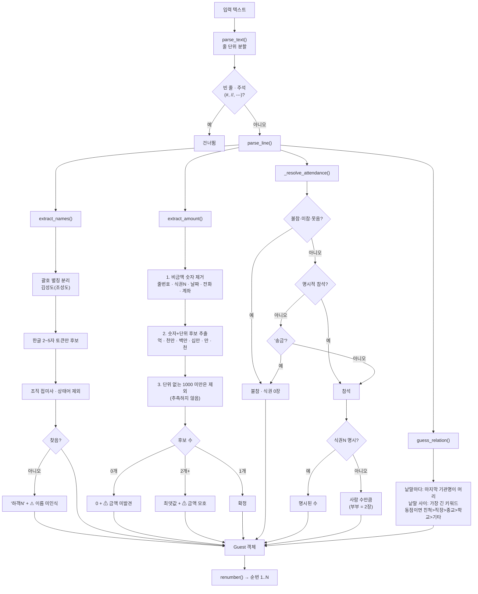
```mermaid
flowchart TD
    A["입력 텍스트"] --> B["parse_text()<br/>줄 단위 분할"]
    B --> C{"빈 줄 · 주석<br/>(#, //, ---)?"}
    C -- 예 --> Z["건너뜀"]
    C -- 아니오 --> D["parse_line()"]

    D --> E["extract_names()"]
    D --> F["extract_amount()"]
    D --> G["_resolve_attendance()"]
    D --> H["guess_relation()"]

    E --> E1["괄호 별칭 분리<br/>김성도(조성도)"]
    E1 --> E2["한글 2~5자 토큰만 후보"]
    E2 --> E3["조직 접미사 · 상태어 제외"]
    E3 --> E4{"찾음?"}
    E4 -- 아니오 --> E5["'하객N' + ⚠ 이름 미인식"]

    F --> F1["1. 비금액 숫자 제거<br/>줄번호 · 식권N · 날짜 · 전화 · 계좌"]
    F1 --> F2["2. 숫자+단위 후보 추출<br/>억 · 천만 · 백만 · 십만 · 만 · 천"]
    F2 --> F3["3. 단위 없는 1000 미만은 제외<br/>(추측하지 않음)"]
    F3 --> F4{"후보 수"}
    F4 -- "0개" --> F5["0 + ⚠ 금액 미발견"]
    F4 -- "2개+" --> F6["최댓값 + ⚠ 금액 모호"]
    F4 -- "1개" --> F7["확정"]

    G --> G1{"불참·미참·못옴?"}
    G1 -- 예 --> G2["불참 · 식권 0장"]
    G1 -- 아니오 --> G3{"명시적 참석?"}
    G3 -- 예 --> G4["참석"]
    G3 -- 아니오 --> G5{"'송금'?"}
    G5 -- 예 --> G2
    G5 -- 아니오 --> G4

    G4 --> T{"식권N 명시?"}
    T -- 예 --> T1["명시된 수"]
    T -- 아니오 --> T2["사람 수만큼<br/>(부부 = 2장)"]

    H --> H1["낱말마다: 마지막 기관명이 머리<br/>낱말 사이: 가장 긴 키워드<br/>동점이면 친척>직장>종교>학교>기타"]

    E5 & E4 & F5 & F6 & F7 & G2 & T1 & T2 & H1 --> Y["Guest 객체"]
    Y --> X["renumber() → 순번 1..N"]
```

### 금액 파싱 규칙표

| 입력 | 결과 | 근거 |
|---|---|---|
| `1 홍길동 200000 친척모임` | 200,000 | 선행 줄번호 제거 |
| `최동료 10만 식권2` | 100,000 | `식권2` 제거 후 단위 해석 |
| `홍대인 50,000 회사` | 50,000 | 이름 속 `대인`은 식권 표기가 아니다 |
| `박지성 100,000 천안` | 100,000 | `천안`의 `천`은 단위가 아니다 |
| `10만 5천원` | 105,000 | 단위 내림차순 → 합산 |
| `3억 2천만원` | 320,000,000 | `천만` 을 `천` 보다 먼저 매칭 |
| `2025-03-14 홍길동 100,000` | 100,000 | 날짜 제거 |
| `홍길동 010-1234-5678 100000` | 100,000 | 전화번호 제거 |
| `500` | **0 + ⚠** | 단위 없는 1000 미만은 추측하지 않음 |
| `이백만원` | **0 + ⚠** | 한글 수사 미지원 → 사용자 확인 |

| `1.5만원` · `0.5만` | 15,000 · 5,000 | 소수점도 숫자의 일부(예전엔 `1` 과 `5만` 으로 쪼개져 50,000) |
| `100.000원` | 100,000 | 점을 천 단위 구분자로 쓴 표기 |

### 이름 · 표 형식 열

- `김철수 , 이영희` 처럼 구분자 양옆을 띄어 써도 부부(2명, 식권 2장)로 읽는다.
- `홍길동님` · `홍길동씨` 는 호칭을 뗀다(떼지 않으면 감사 문구가 "홍길동님님").
- `친구` · `이모` · `신부측` 처럼 **토큰 전체**가 관계어 · 혼주 측 표기면 이름이 아니다.
- 탭 · 두 칸 이상 공백으로 나뉜 줄은 열로 읽는다. `불참` · `계좌` · `식권2` 같은 상태 칸은
  소속으로 넣지 않고, `종교/모임` 처럼 관계 이름을 그대로 적은 칸은 그 관계로 믿는다.

### 관계 분류 규칙

1. 겹치는 매치는 먼저 시작한 쪽을 믿는다(여명교[회사]랑부 → 교회). 단, 뒤쪽이 낱말 끝에 닿으면
   그쪽이 머리다(대학[교회] → 교회).
2. **한 낱말 안에서는 마지막 기관명이 머리**다. 사람 낱말(친구 · 동기 · 이모)은 기관명을 꾸밀 뿐이다.
3. 낱말들 사이에서는 가장 긴 키워드가 이긴다.
4. 사람 이름 속 키워드는 쓰지 않는다(`이사랑` 의 '이사'). 단 `김부장` · `박이모` 같은
   **성 + 호칭** 꼴은 명단에서 흔한 표기라 호칭을 관계 단서로 쓴다.

| 입력 | 결과 | 근거 |
|---|---|---|
| `경북대학교병원` | 직장/기관 | 마지막 기관명 `병원` (예전엔 더 긴 `대학교` 가 이겨 학교) |
| `회사동기` · `교회친구` | 직장 · 종교 | 사람 낱말은 머리가 못 된다 |
| `신부측 대학동기` | 학교/동창 | 성직자는 `신부님` 으로만 인식 |
| `고등학교 동창 목사님` | 학교/동창 | 낱말 사이 최장 일치 |

### Enter 로 표 갱신

명단 입력창에서 Enter 를 칠 때마다(`Ctrl` 없이) `sync_with_text()` 로 표를 맞춘다.
통째로 다시 파싱해 교체하면 표에서 한 일이 사라지므로 **줄(원문) 단위로 맞춘다.**

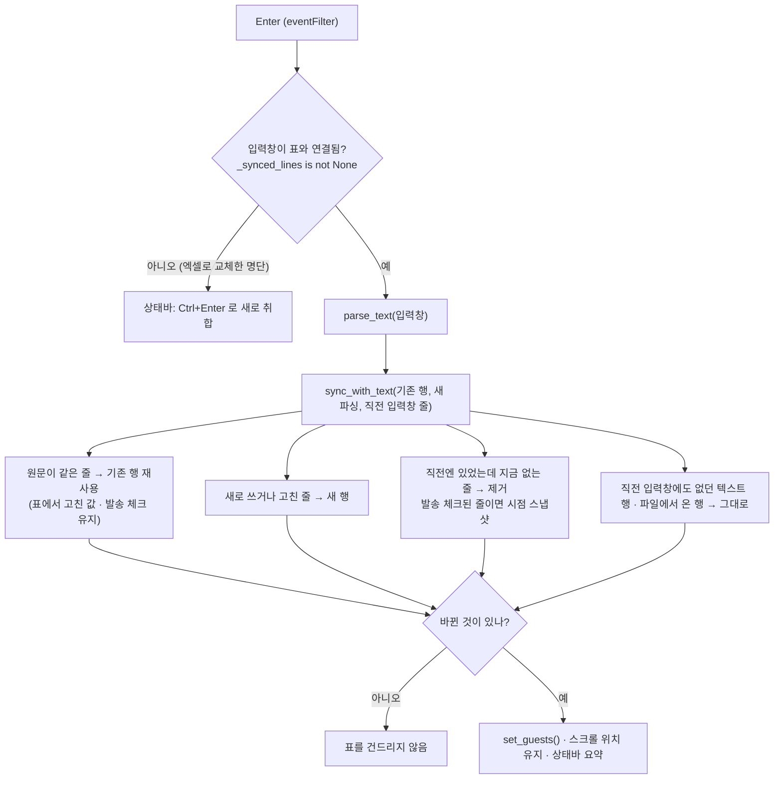
```mermaid
flowchart TD
    A["Enter (eventFilter)"] --> B{"입력창이 표와 연결됨?<br/>_synced_lines is not None"}
    B -- "아니오 (엑셀로 교체한 명단)" --> B1["상태바: Ctrl+Enter 로 새로 취합"]
    B -- 예 --> C["parse_text(입력창)"]
    C --> D["sync_with_text(기존 행, 새 파싱, 직전 입력창 줄)"]
    D --> E1["원문이 같은 줄 → 기존 행 재사용<br/>(표에서 고친 값 · 발송 체크 유지)"]
    D --> E2["새로 쓰거나 고친 줄 → 새 행"]
    D --> E3["직전엔 있었는데 지금 없는 줄 → 제거<br/>발송 체크된 줄이면 시점 스냅샷"]
    D --> E4["직전 입력창에도 없던 텍스트 행 · 파일에서 온 행 → 그대로"]
    E1 & E2 & E3 & E4 --> F{"바뀐 것이 있나?"}
    F -- 아니오 --> G["표를 건드리지 않음"]
    F -- 예 --> H["set_guests() · 스크롤 위치 유지 · 상태바 요약"]
```

순서는 `[앞서 추가한 묶음] + [입력창 순서] + [파일에서 온 줄]`.
엑셀 다시 올리기로 표를 통째로 바꾸면 연결을 끊는다(`_synced_lines = None`). 그대로 두면
입력창의 옛 글이 다음 Enter 에 중복으로 들어간다.

> v1은 줄 전체에서 `re.findall(r'\d+')` 한 결과를 **이어붙였다**.
> `1 홍길동 200000` → `"1"+"200000"` = 1,200,000원(6배).
> `500` 은 `< 1000` 이라는 이유로 500만원으로 승격됐다.

---

## 4. 스프레드시트 파싱 Flow

파일 드롭 또는 `[엑셀 / CSV 불러오기]`

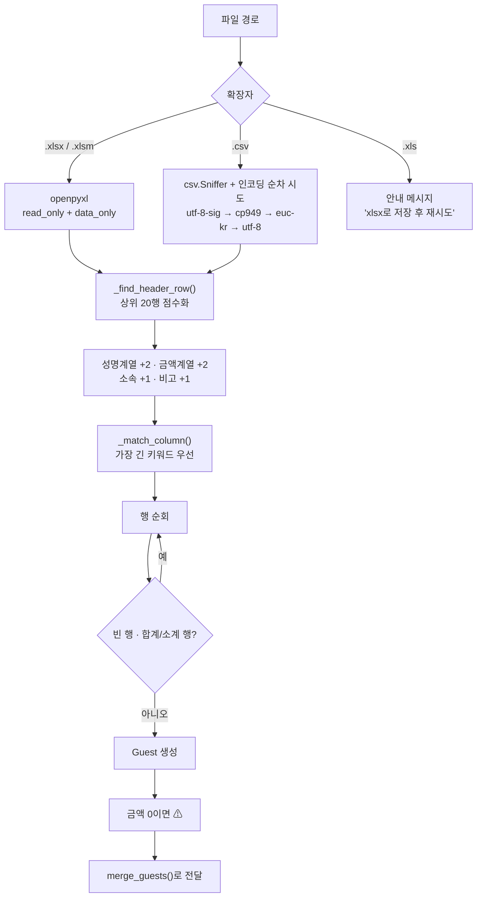
```mermaid
flowchart TD
    A["파일 경로"] --> B{"확장자"}
    B -- ".xlsx / .xlsm" --> C["openpyxl<br/>read_only + data_only"]
    B -- ".csv" --> D["csv.Sniffer + 인코딩 순차 시도<br/>utf-8-sig → cp949 → euc-kr → utf-8"]
    B -- ".xls" --> E["안내 메시지<br/>'xlsx로 저장 후 재시도'"]

    C & D --> F["_find_header_row()<br/>상위 20행 점수화"]
    F --> F1["성명계열 +2 · 금액계열 +2<br/>소속 +1 · 비고 +1"]
    F1 --> G["_match_column()<br/>가장 긴 키워드 우선"]

    G --> H["행 순회"]
    H --> I{"빈 행 · 합계/소계 행?"}
    I -- 예 --> H
    I -- 아니오 --> J["Guest 생성"]
    J --> K["금액 0이면 ⚠"]
    K --> L["merge_guests()로 전달"]
```

**내보낸 명단 감지**: 헤더에 `축의금액 · 관계분류 · 참석여부 · 수령경로 · 발송완료` 가
대부분 있으면 이 프로그램이 내보낸 명단으로 보고 `parse_export_rows()` 로 **모든 열을 그대로**
되살린다. 이때는 병합이 아니라 **교체**한다(확인 창 · 되돌리기). 자세한 것은 15장.

**은행 거래내역 지원**: `보낸분` / `입금액` / `기재내용` / `적요` 컬럼명을 인식하고,
상단 안내 행(계좌번호·조회기간)을 자동으로 건너뛴다.

> v1은 `pd.read_excel(path)` 로 첫 행을 무조건 헤더로 잡아 은행 엑셀을 통째로 실패했고,
> 파일 다이얼로그와 드래그&드롭에서 `.csv` 를 받아놓고 `read_excel` 만 호출해
> `ValueError` 로 죽었다.

---

## 5. 병합 Flow (현금 + 계좌이체)

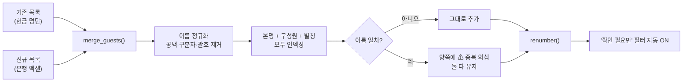
```mermaid
flowchart LR
    A["기존 목록<br/>(현금 명단)"] --> C["merge_guests()"]
    B["신규 목록<br/>(은행 엑셀)"] --> C
    C --> D["이름 정규화<br/>공백·구분자·괄호 제거"]
    D --> E["본명 + 구성원 + 별칭<br/>모두 인덱싱"]
    E --> F{"이름 일치?"}
    F -- 아니오 --> G["그대로 추가"]
    F -- 예 --> H["양쪽에 ⚠ 중복 의심<br/>둘 다 유지"]
    G & H --> I["renumber()"]
    I --> J["'확인 필요만' 필터 자동 ON"]
```

**같은 이름을 자동 병합하지 않는 이유**: 축의금은 돈이다.
동명이인이 현금과 계좌로 각각 낸 경우와 같은 사람이 중복 기입된 경우를
프로그램이 구분할 수 없다. 한 건을 조용히 삼키는 것보다 사용자에게
확인시키는 편이 항상 안전하다.

> v1에는 병합 자체가 없었다. `self.guest_data = parse_...()` 로
> 통째로 덮어써서, 텍스트를 취합한 뒤 엑셀을 드롭하면 현금 내역이 전부 사라졌다.
> README가 내세운 핵심 기능 2번이 코드에 존재하지 않았다.

---

## 6. 정산 Flow

값이 바뀔 때마다(`guestsChanged` · 식대 스핀박스) 재계산된다.

```
총 축의금   = Σ guest.amount
대인 식권   = Σ guest.adult_tickets      ← 불참자는 0
소인 식권   = Σ guest.child_tickets
총 식대     = 대인식권 × 대인단가 + 소인식권 × 소인단가
최종 순정산 = 총 축의금 − 총 식대
```

| | v1 | v2 |
|---|---|---|
| 식대 기준 | 하객 **명** 수 | 발급 **식권** 수 |
| `식권2` 파싱 결과 | 사용 안 함 | 반영 |
| 소인 단가 | **계산에 미반영** | 반영 |
| 불참 하객 | 식대 차감됨 | 제외 |

---

## 7. 표 렌더링 Flow (Model/View)

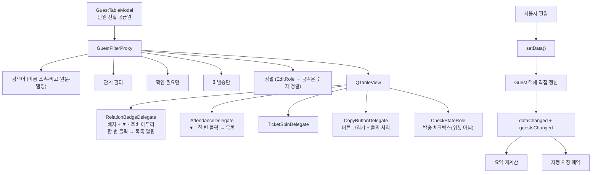
```mermaid
flowchart TD
    A["GuestTableModel<br/>단일 진실 공급원"] --> B["GuestFilterProxy"]
    B --> B1["검색어 (이름·소속·비고·원문·별칭)"]
    B --> B2["관계 필터"]
    B --> B3["확인 필요만"]
    B --> B4["미발송만"]
    B --> B5["정렬 (EditRole → 금액은 숫자 정렬)"]
    B --> C["QTableView"]

    C --> D["RelationBadgeDelegate<br/>배지 + ▼ · 호버 테두리<br/>한 번 클릭 → 목록 열림"]
    C --> E["AttendanceDelegate<br/>▼ · 한 번 클릭 → 목록"]
    C --> F["TicketSpinDelegate"]
    C --> G["CopyButtonDelegate<br/>버튼 그리기 + 클릭 처리"]
    C --> H["CheckStateRole<br/>발송 체크박스(위젯 아님)"]

    I["사용자 편집"] --> J["setData()"]
    J --> K["Guest 객체 직접 갱신"]
    K --> L["dataChanged + guestsChanged"]
    L --> M["요약 재계산"]
    L --> N["자동 저장 예약"]
```

**고르는 칸은 고르는 칸처럼 보인다**: 관계 · 참석 칸은 ▼ 를 직접 그리고(픽셀 폰트에 글자가
없을 수 있다), 한 번 클릭하면 목록이 열리며, 고르면 곧바로 반영 · 닫힌다. 이름 · 금액은 더블클릭.

**줄 삭제**: 우클릭 메뉴 `줄 삭제` 또는 표에 포커스가 있을 때 `Delete`(입력창의 Delete 는 빼앗지 않는다).
여러 줄 · 검색된 상태 모두 프록시 → 원본 행으로 바꿔 지운다. `RemoveGuestsCommand` 가
지운 (위치, 하객) 을 들고 있어 `Ctrl+Z` 로 원래 자리에 돌아온다. 동시에 시점 스냅샷과
토스트 `되돌리기` 도 남는다.

**델리게이트를 쓰는 이유**

| | v1 (QTableWidget) | v2 (Model/View) |
|---|---|---|
| 검색 1글자 입력 | 표 전체 재구축, 300행이면 위젯 1,500개 생성 | 프록시 필터만 재평가, 위젯 생성 0개 |
| 셀 편집 | `guest_data` 미반영 → 다음 렌더링에 **조용히 원복** | `setData` 로 즉시 반영 + 자동 저장 |
| 관계 변경 | 콤보 시그널 안에서 `setRowCount(0)` → **자기 자신 파괴** | 재진입 구조 자체가 없음 |
| 정렬 | 없음 | 모든 열, 금액은 숫자 기준 |

---

## 8. 감사 메시지 Flow

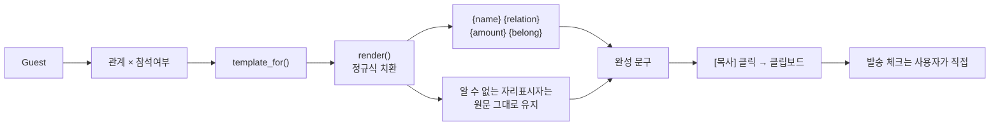
```mermaid
flowchart LR
    A["Guest"] --> B["관계 × 참석여부"]
    B --> C["template_for()"]
    C --> D["render()<br/>정규식 치환"]
    D --> D1["{name} {relation}<br/>{amount} {belong}"]
    D --> D2["알 수 없는 자리표시자는<br/>원문 그대로 유지"]
    D1 & D2 --> E["완성 문구"]
    E --> F["[복사] 클릭 → 클립보드"]
    F --> G["발송 체크는 사용자가 직접"]
```

**`str.format` 을 쓰지 않는 이유**: 템플릿은 사용자가 자유 편집한다.
`.format()` 은 `{` 하나만 있어도 `KeyError` 를 던진다.

> v1은 그 예외가 표 렌더링 루프 안에서 터져 **표 전체가 죽었고**,
> 잘못된 템플릿은 JSON에 영구 저장되어 재실행해도 계속 죽었다.
> v2는 정규식 치환이라 어떤 사용자 입력으로도 예외가 나지 않고,
> 저장 시 미지원 자리표시자를 안내만 한다.

**복사 ≠ 발송**: v1은 복사 버튼을 누르면 자동으로 발송완료 처리했다.
문구를 확인만 하려고 눌러도 발송 처리되어 추적이 무의미해졌다.
v2에서 발송 체크는 사용자가 직접 한다.

---

## 9. 저장 Flow

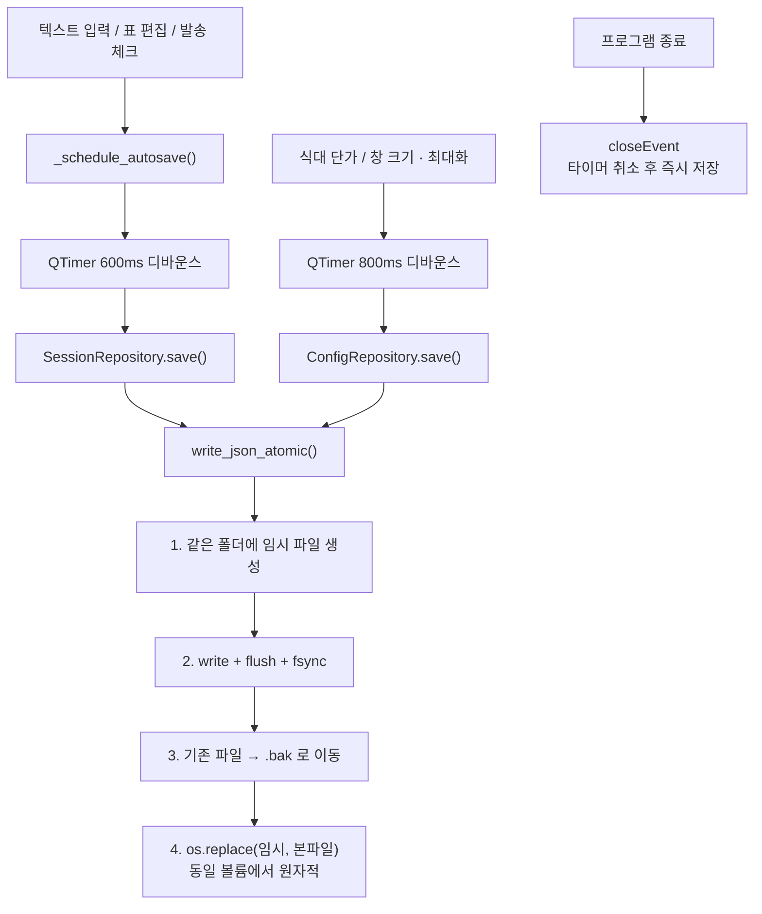
```mermaid
flowchart TD
    A["텍스트 입력 / 표 편집 / 발송 체크"] --> B["_schedule_autosave()"]
    B --> C["QTimer 600ms 디바운스"]
    C --> D["SessionRepository.save()"]

    E["식대 단가 / 창 크기 · 최대화"] --> F["QTimer 800ms 디바운스"]
    F --> G["ConfigRepository.save()"]

    D & G --> H["write_json_atomic()"]
    H --> H1["1. 같은 폴더에 임시 파일 생성"]
    H1 --> H2["2. write + flush + fsync"]
    H2 --> H3["3. 기존 파일 → .bak 로 이동"]
    H3 --> H4["4. os.replace(임시, 본파일)<br/>동일 볼륨에서 원자적"]

    I["프로그램 종료"] --> J["closeEvent<br/>타이머 취소 후 즉시 저장"]
```

**읽기 시 자동 복구**: `read_json()` 은 본 파일이 깨졌으면 `.bak` 을 시도한다.

| | v1 | v2 |
|---|---|---|
| 저장 위치 | 실행 디렉터리 (상대 경로) | `%LOCALAPPDATA%\ChuguiMaster\` |
| 저장 빈도 | **키 입력 한 번마다 전체 JSON** | 600ms 디바운스 |
| 저장 방식 | 대상 파일 직접 덮어쓰기 | 임시 파일 + `os.replace` |
| 손상 시 | 복구 불가 | `.bak` 자동 복구 |
| 실패 시 | `except: pass` (무성) | 로그 + 상태바 안내 |

> v1은 `Program Files` 에 설치하면 저장이 실패하는데 사용자는 영문도 몰랐다.
> `--onefile` exe는 실행 위치가 매번 달라 설정이 여기저기 흩어졌다.

---

## 10. 전체 사용자 시나리오

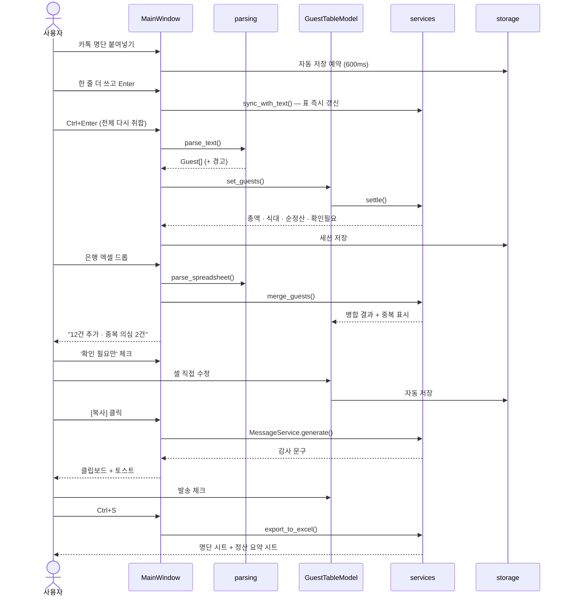
```mermaid
sequenceDiagram
    actor U as 사용자
    participant W as MainWindow
    participant P as parsing
    participant M as GuestTableModel
    participant S as services
    participant R as storage

    U->>W: 카톡 명단 붙여넣기
    W->>R: 자동 저장 예약 (600ms)
    U->>W: 한 줄 더 쓰고 Enter
    W->>S: sync_with_text() — 표 즉시 갱신
    U->>W: Ctrl+Enter (전체 다시 취합)
    W->>P: parse_text()
    P-->>W: Guest[] (+ 경고)
    W->>M: set_guests()
    M->>S: settle()
    S-->>W: 총액 · 식대 · 순정산 · 확인필요
    W->>R: 세션 저장

    U->>W: 은행 엑셀 드롭
    W->>P: parse_spreadsheet()
    W->>S: merge_guests()
    S-->>M: 병합 결과 + 중복 표시
    W-->>U: "12건 추가 · 중복 의심 2건"

    U->>W: '확인 필요만' 체크
    U->>M: 셀 직접 수정
    M->>R: 자동 저장

    U->>W: [복사] 클릭
    W->>S: MessageService.generate()
    S-->>W: 감사 문구
    W-->>U: 클립보드 + 토스트
    U->>M: 발송 체크

    U->>W: Ctrl+S
    W->>S: export_to_excel()
    S-->>U: 명단 시트 + 정산 요약 시트
```

---

## 11. 오류 처리 원칙

| 상황 | 동작 |
|---|---|
| 파서가 확신 못 함 | 추측하지 않고 `⚠ 확인 필요` 표시, KPI 카드에 건수 노출 |
| 사용자 파일이 이상함 | `ExcelParseError` → 원인이 담긴 안내 다이얼로그 |
| 저장 실패 | 로그 기록 + 상태바 안내 (무성 실패 금지) |
| 세션 파일 손상 | `.bak` 자동 복구, 실패 시 빈 세션 |
| 처리되지 않은 예외 | 로그 + "작업은 자동 저장되어 있습니다" 안내, 로그 경로 표시 |
| 잘못된 사용자 템플릿 | 예외 없이 원문 유지, 저장 시 안내 |

로그 위치: `%LOCALAPPDATA%\ChuguiMaster\logs\chugui.log` (1MB × 3세대 회전)

---

## 12. 테스트 구성

| 파일 | 개수 | 범위 |
|---|---:|---|
| `conftest.py` | — | 데이터 디렉터리 격리(`CHUGUI_DATA_DIR`), 오프스크린 Qt |
| `test_ux.py` | 79 | 대비비(레트로 팔레트) · 접근성 · 빈 상태 · 레이아웃(가로 · 세로) · 전체 화면 · 피드백 |
| `test_amount.py` | 40 | 금액 파서 — v1의 6배 오류 회귀 방지 |
| `test_storage.py` | 39 | 원자적 쓰기 · 손상 복구 · v1 스키마 호환 · 구버전 테마 키 무시 |
| `test_parser_accuracy.py` | 39 | 소수 금액 · 이름 · 호칭 · 관계(합성어 머리 포함) — 조용한 오답 회귀 방지 |
| `test_tickets.py` | 32 | 식권 표기 — 이름 속 '대인/소인' 오인 회귀 방지 |
| `test_messages.py` | 30 | 템플릿 크래시 방지 · 자리표시자 · 조사 문제 |
| `test_names_relations.py` | 29 | 이름 추출 — v1의 글자 단위 삭제 버그 회귀 방지 |
| `test_text_parser.py` | 28 | 자유 텍스트 통합 + 샘플 데이터 총액 고정 |
| `test_columns.py` | 28 | 탭/공백 열 인식 · 관계 겹침 제거 |
| `test_ui_model.py` | 27 | 모델 · 프록시 · 정렬 (오프스크린) |
| `test_snapshots.py` | 18 | 링 버퍼 · 목록 · 되돌리기 |
| `test_undo.py` | 16 | Undo/Redo · 스택 위생 |
| `test_excel_export.py` | 15 | 헤더 탐색 · CSV · 내보내기 |
| `test_settlement_merge.py` | 14 | 정산식 + 병합 |
| `test_live_sync.py` | 14 | Enter 갱신 줄 맞춤 · 표 수정 유지 · 엑셀 교체 후 연결 해제 |
| `test_export_roundtrip.py` | 14 | 엑셀 내보내기 → 수정 → 다시 올리기(교체) |
| `test_crash_recovery.py` | 14 | 표식 · 복구 안내 · 두 번 실행 방지(실제 프로세스 2개) |
| `test_row_delete.py` | 12 | 줄 삭제 · 원래 자리 복원 · 필터 상태 삭제 |
| `test_e2e.py` | 9 | 한 사람의 전체 사용 흐름 + 텍스트 내보내기 되읽기 |
| `test_dropdowns.py` | 6 | 한 번 클릭 목록 · 우클릭 메뉴 스타일 |
| `test_version.py` | 2 | 화면 · 패키지 · 문서 버전 일치 |
| **합계** | **505** | |

```bash
python -m pytest
```

파싱·정산 로직은 Qt에 의존하지 않으므로 GUI 없이 검증된다.
GUI가 필요한 테스트도 `QT_QPA_PLATFORM=offscreen` 으로 헤드리스 CI에서 돈다.

---

## 13. 복구 Flow

되돌려야 할 일은 두 종류다. 성격이 다르므로 장치도 다르다.

| 사고 | 장치 | 최대 손실 |
|---|---|---|
| 전원 차단 · 강제 종료 | 원자적 자동 저장 + `.bak` | 600ms |
| 셀 하나 잘못 고침 | `Ctrl+Z` (QUndoStack) | 없음 |
| 비우기 · 덮어쓰기 · 줄 삭제 오클릭 | 토스트 `되돌리기` (3초) · 줄 삭제는 `Ctrl+Z` 도 | 없음 |
| 창을 두 번 띄움 | 두 번째 실행 차단(`QLockFile`) | 없음 |
| 한참 전 상태로 돌아가고 싶음 | 시점 스냅샷 (최대 20개) | 최대 5분 |

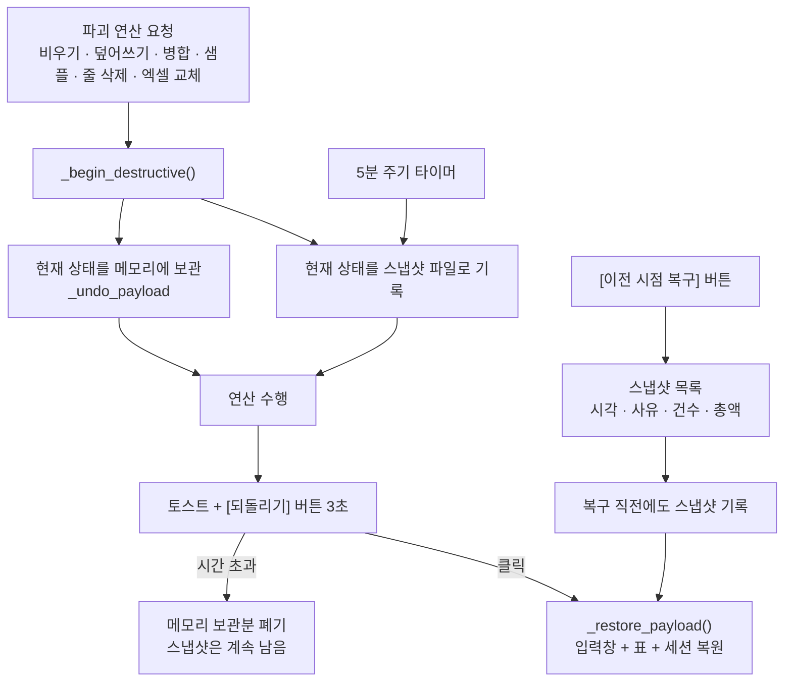
```mermaid
flowchart TD
    A["파괴 연산 요청<br/>비우기 · 덮어쓰기 · 병합 · 샘플 · 줄 삭제 · 엑셀 교체"] --> B["_begin_destructive()"]
    B --> C["현재 상태를 스냅샷 파일로 기록"]
    B --> D["현재 상태를 메모리에 보관<br/>_undo_payload"]
    C & D --> E["연산 수행"]
    E --> F["토스트 + [되돌리기] 버튼 3초"]
    F -- "클릭" --> G["_restore_payload()<br/>입력창 + 표 + 세션 복원"]
    F -- "시간 초과" --> H["메모리 보관분 폐기<br/>스냅샷은 계속 남음"]

    I["5분 주기 타이머"] --> C
    J["[이전 시점 복구] 버튼"] --> K["스냅샷 목록<br/>시각 · 사유 · 건수 · 총액"]
    K --> L["복구 직전에도 스냅샷 기록"]
    L --> G
```

**`전체 비우기` 는 세션 파일과 `.bak` 을 지우지만 스냅샷은 남긴다.**
v2.0에서 이 조합은 되돌릴 방법이 전혀 없었다.

### 비정상 종료 감지

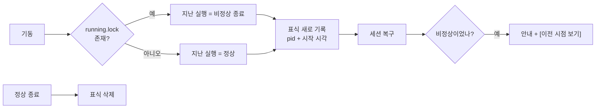
```mermaid
flowchart LR
    A["기동"] --> B{"running.lock<br/>존재?"}
    B -- 예 --> C["지난 실행 = 비정상 종료"]
    B -- 아니오 --> D["지난 실행 = 정상"]
    C & D --> E["표식 새로 기록<br/>pid + 시작 시각"]
    E --> F["세션 복구"]
    F --> G{"비정상이었나?"}
    G -- 예 --> H["안내 + [이전 시점 보기]"]
    I["정상 종료"] --> J["표식 삭제"]
```

앱은 자기가 지난번에 어떻게 끝났는지 모른다. 표식이 없으면
"지난번에 갑자기 꺼졌습니다. 작업은 복구했습니다"라고 말해 줄 수 없고,
사용자는 자기 작업이 살아 있는지 모른 채 불안해한다.

### 되돌리기 스택 위생

- 목록이 통째로 바뀌면(`set_guests`) 스택을 비운다 — 행 번호가 가리키던 대상이 사라진다
- 줄 삭제는 스택에 쌓는다. 삭제 · 복원이 스택 순서대로만 일어나므로 앞서 쌓인 셀 편집의
  행 번호는 되돌리기 · 다시하기 내내 같은 하객을 가리킨다
- 거부되는 편집(빈 이름)은 명령으로 쌓지 않는다
- 값이 그대로인 편집도 쌓지 않는다
- 참석 → 불참 변경은 식권을 0으로 만든다. 되돌리면 식권도 함께 돌아온다

---

## 14. UX 검증

디자인은 코드 리뷰로 지키기 어렵다. 객관적으로 측정 가능한 것은 테스트로 고정한다.
`tests/test_ux.py` 가 검사하는 항목:

### 대비비 (WCAG 2.1 AA)

모든 텍스트 색 × 배경 조합을 **레트로 팔레트**에 대해 계산한다(다크 · 라이트는 v2.2 에서 제거).

| 대상 | 기준 |
|---|---|
| 본문 텍스트 (`text` · `text_muted` · `text_subtle`) × 4개 표면 | 4.5:1 |
| 강조색 · 위험색 · 경고 배너 | 4.5:1 |
| 관계 배지 5종 텍스트 | 4.5:1 |
| 채워진 버튼(primary · success) 위의 흰 글씨 | 4.5:1 |
| 포커스 링 · 입력 테두리 | 3:1 |
| 교대 행 줄무늬 | 1.01 ~ 1.35 (구분되되 거슬리지 않게) |

> 이 테스트가 실제로 두 건을 잡았다. success 버튼의 `#059669` 는 흰 글씨 기준 3.77:1로
> 미달이라 `#047857` 로 낮췄고, 라이트 테마 순정산 값 색도 같은 이유로 조정했다.

### 접근성

- 모든 상호작용 컨트롤이 `accessibleName` 또는 툴팁을 가진다
- KPI 카드가 `accessibleDescription` 으로 현재 값을 노출한다
- 단축키(`Ctrl+Enter` · `Ctrl+S` · `Ctrl+F`)가 등록되어 있고 실제로 동작한다
- 편집 가능한 열이 그 사실을 툴팁으로 알린다
- 복사 셀이 보낼 문구를 미리 보여준다

### 레이아웃 견고성

- 선언한 최소 창 크기가 레이아웃의 실제 요구치보다 크다 — **가로와 세로 모두**
  (세로가 모자라 입력 안내 글자가 서로 겹친 일이 있었다)
- KPI 값이 어떤 금액(10만 ~ 3억 2천만)에서도 잘리지 않는다
- 짧은 값에서는 큰 글씨를 유지한다 (무조건 축소하면 위계가 무너진다)
- 토스트가 창 밖으로 나가지 않고, 창 크기가 바뀌면 다시 중앙에 온다
- 스플리터로 패널을 0px까지 접을 수 없다

> 이 테스트가 KPI 행 과밀을 잡았다. 초안은 카드 5장(식대 입력 포함)을 한 줄에 넣어
> 카드 폭이 179px까지 좁아졌고, `100,000원` 조차 기본 크기로 표시되지 못했다.
> 입력은 지표가 아니므로 별도 설정 줄로 분리해 카드를 273px로 넓혔다.

### 상태 · 피드백

- 빈 화면일 때 빈 격자 대신 다음 할 일을 안내한다
- 필터 결과가 0건일 때와 데이터가 아예 없을 때 **다른 문구**를 보여준다
- 확인 필요 배너는 0건이면 나타나지 않고, 고치면 사라진다
- 확인 필요 행은 배경색으로 구분되며 테마를 따라간다
- 복사해도 발송완료로 표시되지 않는다
- 상태바가 건수 · 평균 · 발송 진행률을 요약한다
- 카드가 숫자의 근거를 캡션으로 보여준다 (사용자가 검산할 수 있게)
- 우클릭 메뉴 · 목록 · 메시지 상자가 테마 색으로 칠해진다(흰 바탕에 밝은 글자 금지)
- 확인 창 버튼은 한국어(`예` / `아니요`)

---

## 15. 내보내기 Flow

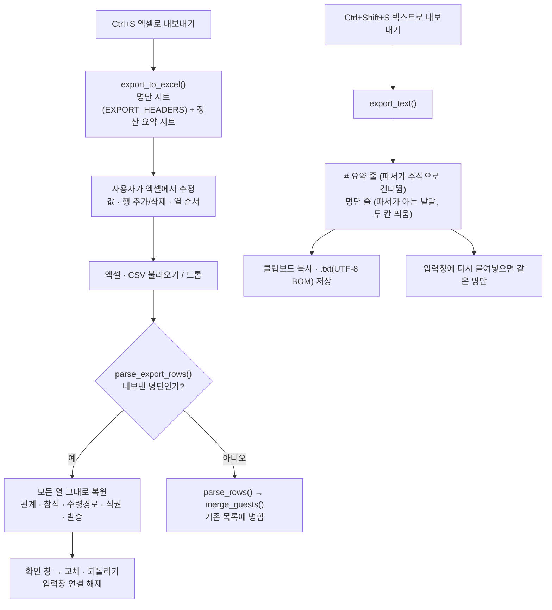
```mermaid
flowchart TD
    A["Ctrl+S 엑셀로 내보내기"] --> B["export_to_excel()<br/>명단 시트(EXPORT_HEADERS) + 정산 요약 시트"]
    B --> C["사용자가 엑셀에서 수정<br/>값 · 행 추가/삭제 · 열 순서"]
    C --> D["엑셀 · CSV 불러오기 / 드롭"]
    D --> E{"parse_export_rows()<br/>내보낸 명단인가?"}
    E -- 예 --> F["모든 열 그대로 복원<br/>관계 · 참석 · 수령경로 · 식권 · 발송"]
    F --> G["확인 창 → 교체 · 되돌리기<br/>입력창 연결 해제"]
    E -- 아니오 --> H["parse_rows() → merge_guests()<br/>기존 목록에 병합"]

    I["Ctrl+Shift+S 텍스트로 내보내기"] --> J["export_text()"]
    J --> K["# 요약 줄 (파서가 주석으로 건너뜀)<br/>명단 줄 (파서가 아는 낱말, 두 칸 띄움)"]
    K --> L["클립보드 복사 · .txt(UTF-8 BOM) 저장"]
    K --> M["입력창에 다시 붙여넣으면 같은 명단"]
```

**왜 교체인가**: 같은 사람들이 다시 들어오므로 병합하면 목록이 두 배가 되고 전부
`중복 의심` 이 된다. 예전에는 실제로 그랬고, 발송완료 · 참석 · 수령경로는 사라지고
관계는 소속 칸으로 들어갔다.

**열 제목은 한 곳**(`excel_parser.EXPORT_HEADERS`)에서 내보내기와 다시 불러오기가 함께 쓴다.
한쪽만 바꾸면 되살리기가 깨진다.

**감사메시지 열은 되읽지 않는다.** 문구는 관계 × 참석으로 매번 만들어지므로,
문구 자체를 바꾸려면 `인사말 템플릿` 을 고친다.
