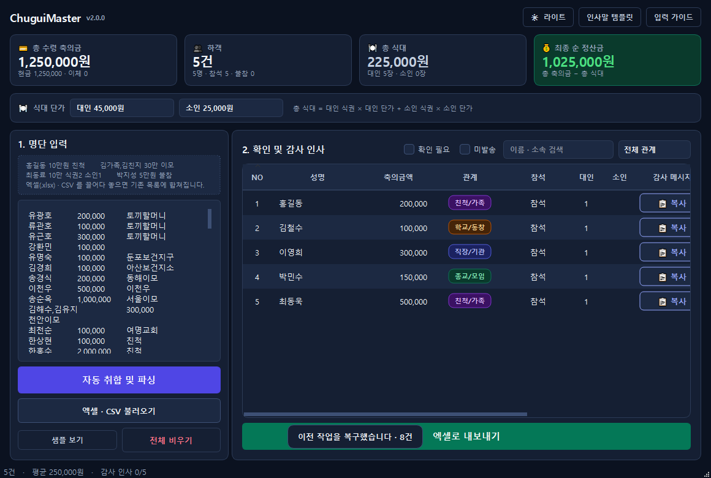

# 📖 축의금 마스터 (ChuguiMaster v2.0.0)

> 🔒 **개인정보 보호(Anonymization) 완벽 보장**: 본 문서에 수록된 모든 스크린샷 이미지 및 수치(`1,250,000원`, `5건` 등)는 **Qt `widget.grab()` 동적 익명 UI 캡처 기술**을 통해 실제 하객 개인정보 노출 없이 100% 가상 데이터(`홍길동`, `김철수`, `이영희`, `박민수`, `최동욱`)로 자동 생성된 화면입니다.

---

## 1. 📊 한눈에 보는 컴팩트 스마트 대시보드



### 💡 주요 기능
- **총 수령 축의금**: 수령한 총 금액과 현금/계좌이체 수령액을 실시간 집계합니다.
- **하객 통계**: 총 등록 건수, 실제 방문 인원, 참석 및 불참 하객 수를 한눈에 계산합니다.
- **총 식대**: 대인/소인 식권 발급 수량에 맞춰 총 식대를 자동으로 산출합니다.
- **최종 순 정산금**: `총 수령 축의금 − 총 식대`를 차감하여 실제 남은 순 정산금을 직관적으로 보여줍니다.

---

## 2. 🍽️ 실시간 식대 단가 설정 및 자동 재계산


### 💡 주요 기능
- **단가 자유 변경**: 대인(성인) 식대 단가와 소인(어린이) 식대 단가를 자유롭게 조정할 수 있습니다.
- **즉시 실시간 반영**: 화살표 버튼 클릭 및 숫자 직접 입력 후 Enter 키를 누르는 즉시 상단 대시보드의 **총 식대** 및 **최종 순 정산금**이 0.1초 만에 자동 계산됩니다.
- **자동 저장**: 설정한 식대 단가는 프로그램 종료 후 다시 실행해도 이전 설정값이 자동으로 유지됩니다.

---

## 3. 🏷️ 하객 명단 관리 및 드롭다운 카테고리 태그


### 💡 주요 기능
- **드롭다운 카테고리 태그**: 관계 태그(`친척`, `친구`, `직장`, `교회`, `기타`)를 클릭하여 손쉽게 변경할 수 있습니다.
- **카테고리 변경 시 즉시 갱신**: 관계를 변경하면 하객의 맞춤 감사 인사말 템플릿과 스타일 태그가 즉시 변경됩니다.
- **다크 모드 가독성 지원**: 어두운 테마에서도 모든 하객의 이름과 금액 텍스트가 시원하고 선명하게 표현됩니다.

---

## 4. 💬 감사 인사말 1초 클립보드 복사

### 💡 주요 기능
- **1초 복사 버튼**: 각 하객 행의 `[📋 복사]` 버튼 또는 `Ctrl+C`를 누르면, 가상 하객 이름과 축의금에 맞춘 감사 인사말이 즉시 클립보드에 복사됩니다.
- **예시 메세지**:
  > *"홍길동 님, 저희 결혼식에 귀한 걸음 해 주시고 축의금(200,000원)으로 축하해 주셔서 진심으로 감사드립니다. 예쁘게 잘 살겠습니다!"*
- **카카오톡/문자 즉시 발송**: 복사 후 카카오톡 채팅창이나 문자 메시지창에 `Ctrl+V`로 붙여넣어 바로 발송할 수 있습니다.

---

## 5. 📸 `widget.grab()` 익명 UI 스크린샷 자동 캡처 서비스

### 💡 주요 기능
- **개인정보 100% 방어 동적 캡처**: 실제 사용자의 하객 명단을 전혀 건드리지 않고, 메모리상에서 임시 가상 데이터(`홍길동`, `김철수` 등)를 주입한 뒤 UI 화면을 `widget.grab()`으로 동적 PNG 이미지 파일로 추출합니다.
- **원격 복원 보장**: 캡처가 완료되면 기존의 실제 하객 명단과 정산 데이터로 100% 안전하게 자동 원복(Restore)됩니다.

---

## 6. 💾 자동 저장 & 세션 복구 기능 (DB-less)

### 💡 주요 기능
- **실시간 자동 저장**: 명단을 입력하거나 수정할 때마다 별도의 저장 버튼을 누르지 않아도 실시간으로 `autosave_session.json`에 안전하게 보관됩니다.
- **갑작스러운 종료 후 100% 복구**: 컴퓨터가 꺼지거나 프로그램을 다시 켜면 이전 작업 상태를 자동으로 불러옵니다.

---

## 🚀 실행 및 빌드 방법

### 실행
```bash
python main.py
```

### 단일 실행 파일 (.exe) 빌드
```bash
python build.py --onefile
```
* **산출물 경로**: `dist/ChuguiMaster.exe`
